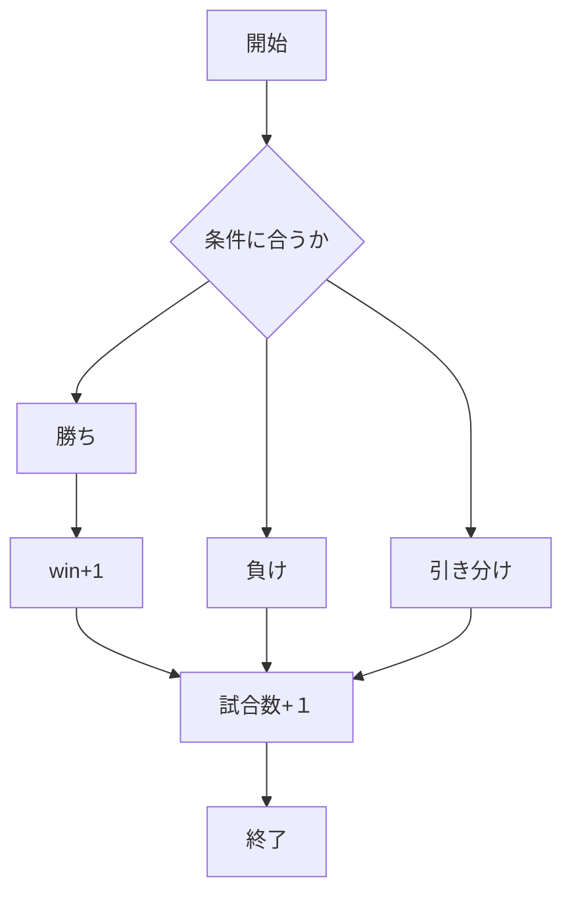
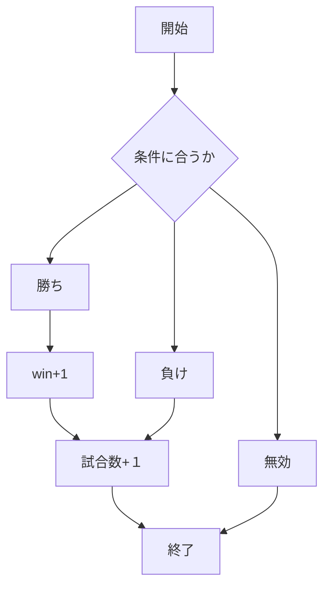
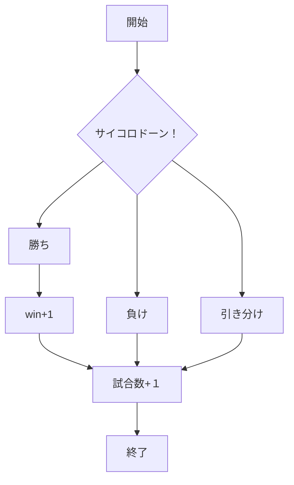

# webpro_06

## ファイル一覧
プログラム | 説明
-|-
app5.js | プログラム本体
public/janken.html | じゃんけんの開始画面
views/janken.ejs | じゃんけんテンプレートファイル
public/tyouhan.html | 丁半開始画面
views/tyouhan.ejs | 丁半テンプレートファイル
public/tintiro.html | チンチロ開始画面
views/tintiro.ejs | チンチロテンプレートファイル

## じゃんけん
じゃんけんをweb上で1対1で行うプログラムjankenを作成した．

### janken.html
```html
<form action="/janken">
        <input type="text" name="hand" required>
        <label for="hand">何を出す？</label>
        <input type="submit" values="じゃんけん　ポン">
        <input type="hidden" name="win" value="0">
        <input type="hidden" name="total" value="0">
    </form>
```
html特有のtypeのうちのtextでプレイヤーの手を入力するボックスを作り，入力結果をapp5.jsに送信している．

### app5.js
```javascript
app.get("/janken", (req, res) => {
    console.log( {hand, win, total});
```
プレイヤーの手と勝数，試合数の関数を定義する．

```javascript
   const num = Math.floor( Math.random() * 3 + 1 );

    let cpu = '';
  if( num==1 ) cpu = 'グー';
  else if( num==2 ) cpu = 'チョキ';
  else cpu = 'パー';
```
乱数３を用意し，コンピュータの手を割り当てる．

```javascript
let judgment = ''
  if (hand === cpu) {
    judgement = '引き分け';
  } else if (
    (hand === 'グー' && cpu === 'チョキ') ||
    (hand === 'チョキ' && cpu === 'パー') ||
    (hand === 'パー' && cpu === 'グー')
  ) {
    judgement = '勝ち';
    win += 1;
  } else {
    j;udgement = '負け';
  }
  total += 1; 
```
プレイヤーが入力した手と乱数で決まったコンピュータの手によって勝敗を決定し，試合数をカウントする．また，プレイヤーが勝った場合はwinの値に１を加える．

### janken.ejs

```ejs
<p>あなたの手は<%= your %>です．</p>
    <p>コンピュータは<%= cpu %>です．</p>
    <p>判定：<%= judgement %></p>
    <p>現在<%= total %>試合中<%= win %>勝しています．</p>
    <hr>
```
app5.jsで得られた結果をweb上に表示する

```ejs
<form action="/janken">
        <input type="text" name="hand" required>
        <label for="hand">次は何を出す？</label>
        <input type="hidden" name="win" value="<%= win %>">
        <input type="hidden" name="total" value="<%= total %>">
        <input type="submit" values="じゃんけん　ポン">
    </form>  
```
次の試合を開始する．

###　使用方法
1. app5.js を起動する．
1. Webブラウザでlocalhost:8080/public/janken.htmlにアクセスする
1. 自分の手を入力する


## 丁半
web上で簡易的な丁半博打ができるプログラムを作成した．
仕様
1. 子（プレイヤー）と親（コンピュータ）にわかれる
1. プレイヤーが手を入力でき，コンピュータの手をランダムで表示する
1. 勝ち負けを判断し，表示する
1. 試合数を表示し，プレイヤーが勝った場合勝ちをプラス1し表示する
### tyouhan.html
```html
<form action="/tyouhan">
        <input type="text" name="hands" required>
        <label for="hands">何を出す？</label>
        <input type="submit" values="丁か半か">
        <input type="hidden" name="win" value="0">
        <input type="hidden" name="total" value="0">
    </form>
```
プレイヤーが手を入力できるテキストフォームを作り，フォームを送信する．

### app5.js
```javascript
app.get("/tyouhan", (req, res) => {
  let hands = req.query.hands;
  let win = Number( req.query.win )||0;
  let total = Number( req.query.total )||0;
  console.log( {hands, win, total});
```
プレイヤーが入力した手と，勝数と試合数が０であることを定義している．

```javascript
const num = Math.floor( Math.random() * 2) + 1;
  let cpu = '';
  if( num==1 ){
   cpu = '半';
  }else if(num==2){
    cpu = '丁';
  }
```
乱数２をコンピュータの手に割り当てる．

```javascript
let judgement = ''
  if (hands !== '半' && hands !== '丁') {
    judgement = '無効';  // 不正な入力を検出
  } else if (hands === cpu) {
    judgement = '勝ち';
    win += 1;
    total += 1;
  } else if (
    (hands === '半' && cpu === '丁') || 
    (hands === '丁' && cpu === '半')
  ) {
    judgement = '負け';
    total += 1;
  }
```
プレイヤーが入力したものが”丁””半”以外の者であるとき，無効とし，当てはまるときは，プレイヤーが入力した手と乱数で決まったコンピュータの手によって勝敗を決定し，試合数をカウントする．また，プレイヤーが勝った場合はwinの値に１を加える．
```ejs
<p>あなたの予想は<%= your %>です．</p>
    <p>結果は<%= cpu %>です．</p>
    <p>判定：<%= judgement %></p>
    <p>現在<%= total %>試合中<%= win %>勝しています．</p>
    <hr>
    <form action="/tyouhan">
        <input type="text" name="hands" required>
        <label for="hands">丁か半か？</label>
        <input type="hidden" name="win" value="<%= win %>">
        <input type="hidden" name="total" value="<%= total %>">
        <input type="submit" values="丁半">
    </form>   
```
app5.jsで得られた結果をweb上に表示し，次の試合を開始する．

### 使用方法
1. app5.js を起動する．
1. Webブラウザでlocalhost:8080/public/tyouhan.htmlにアクセスする
1. 自分の手を入力する



## チンチロ
web上で簡易的なチンチロができるプログラムを作成した．
仕様
1. プレイヤーとcpuがそれぞれ3つのサイコロを振り，チンチロのルールにより勝敗を決定する
1. 勝敗を表示し，試合数と勝利数を表示する

### tintiro.html
```html
<form action="/tintiro">
        <input type="button" name="battle" id="battle">
        <label for="battle">勝負</label>
        <input type="submit" values="押す">
        <input type="hidden" name="win" value="0">
        <input type="hidden" name="total" value="0">
    </form>
```
ボタンタグを作り，プレイヤーがタグを触るとプログラムが開始する

### app5.js
```javascript
app.get("/tintiro", (req, res) => {
  let battle = req.query.battle;
  let win = Number( req.query.win )||0;
  let total = Number( req.query.total )||0;
  const num = Math.floor( Math.random() * 6) + 1;
  const num1 = Math.floor( Math.random() * 6) + 1;
  const num2 = Math.floor( Math.random() * 6) + 1;
  const num3 = Math.floor( Math.random() * 6) + 1;
  const num4 = Math.floor( Math.random() * 6) + 1;
  const num5 = Math.floor( Math.random() * 6) + 1;

  console.log( {num, num1, num2, num3, num4, num5, win, total, battle});
```
ボタンタグの動作を確認し，プログラムを開始し，勝利数と試合数を０とし，サイコロを６つ作るために乱数６のものを６つ定義する

```javascript
let your = ''
  if (num === 1 && num1 === 1 && num2 === 1){
    your = 'ピンゾロ'
  } else if(num === 2 && num1 === 2 && num2 === 2) {
    your = '2の嵐';
  } else if(num === 3 && num1 === 3 && num2 === 3) {
    your = '3の嵐';
         .
         .
         .
```
乱数の結果より，プレイヤーとcpuの役を決定する

```javascript
let judgement = ''
  if (your === cpu){
    judgement = '引き分け';
  } else if(
    (your === 'ピンゾロ' && cpu !== 'ピンゾロ')||
    (your === '6の嵐' && cpu !== 'ピンゾロ' && cpu !== '6の嵐')||
    (your === '5の嵐' && cpu !== 'ピンゾロ' && cpu !== '6の嵐' && cpu !== '5の嵐')||
    (your === '4の嵐' && cpu !== 'ピンゾロ')||
    (your === '4の嵐' && cpu !== '6の嵐')||
    (your === '4の嵐' && cpu !== '5の嵐')||
            .
            .
            .
    (your === '1' && cpu === '目なし')||
    (your === '1' && cpu === 'ヒフミ')||
    (your === '目なし' && cpu === 'ヒフミ')
  ) {
    judgement = '勝ち';
    win += 1;
  } else {
    judgement = '負け';
  }
  total += 1; 
```
役の結果より勝敗を決定し，試合数を＋１し，プレイヤーが勝利した場合勝利数を＋１をする

### tintiro.ejs
```ejs
<body>
    <p>あなたの手は<%= your %><%= your1 %><%= your2 %>です．</p>
    <p>コンピュータは<%= cpu %><%= cpu1 %><%= cpu2 %>です．</p>
    <p>判定：<%= judgement %></p>
    <p>現在<%= total %>回中<%= win %>勝しています．</p>
    <hr>
    <form action="/tintiro">
        <input type="button" name="battle" id="battle">
        <label for="battle">もう一回</label>
        <input type="hidden" name="win" value="<%= win %>">
        <input type="hidden" name="total" value="<%= total %>">
        <input type="submit" values="勝負">
    </form>   
</body>
```
勝敗と試合数，勝利数を表示し，次の試合を催促する

### 使用方法
1. app5.js を起動する．
1. Webブラウザでlocalhost:8080/public/tintiro.htmlにアクセスする
1. ボタンタグをクリックする



11/18